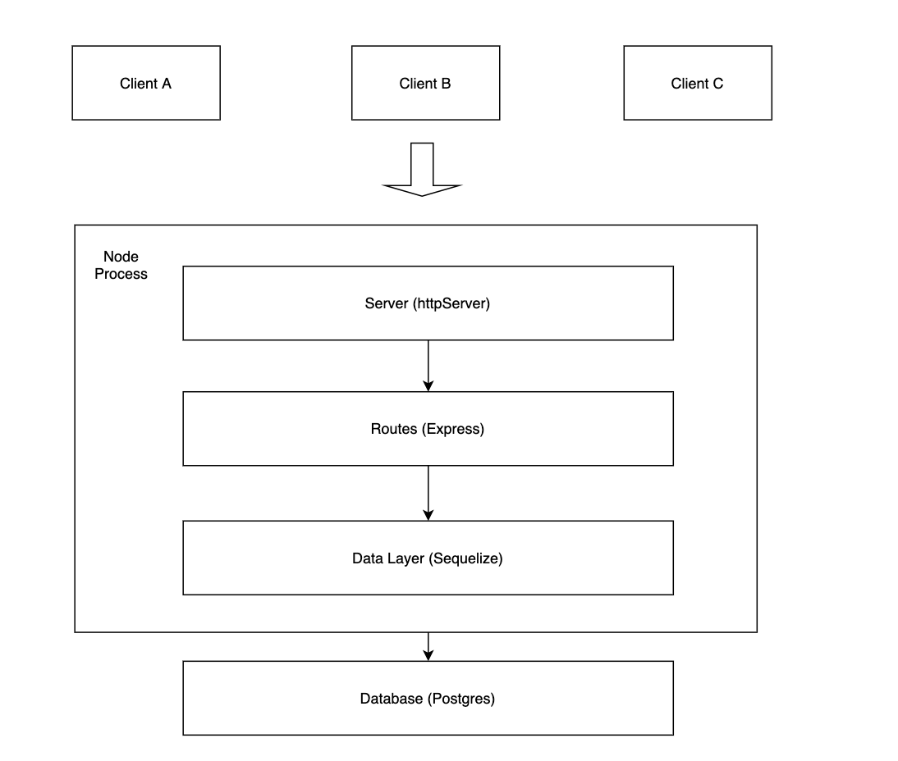
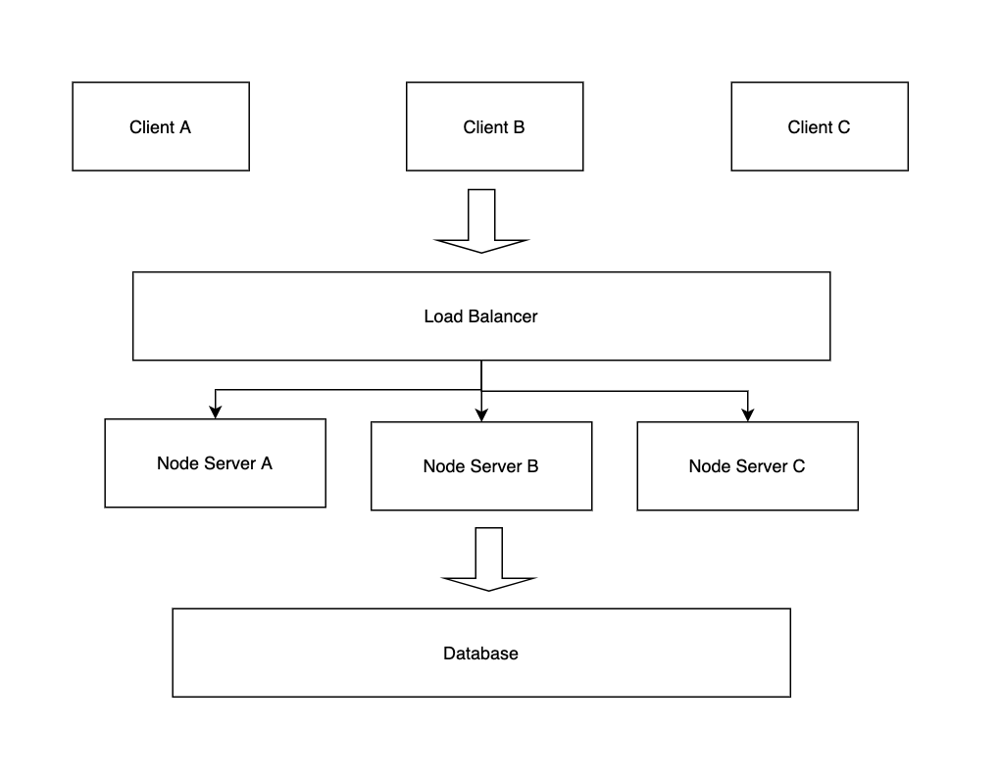
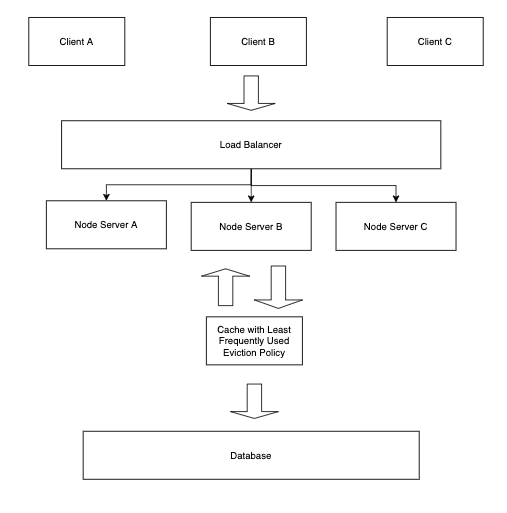
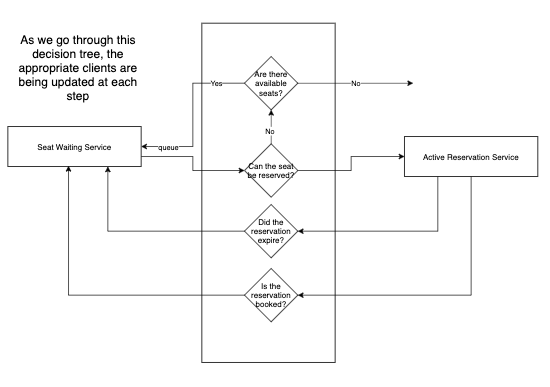
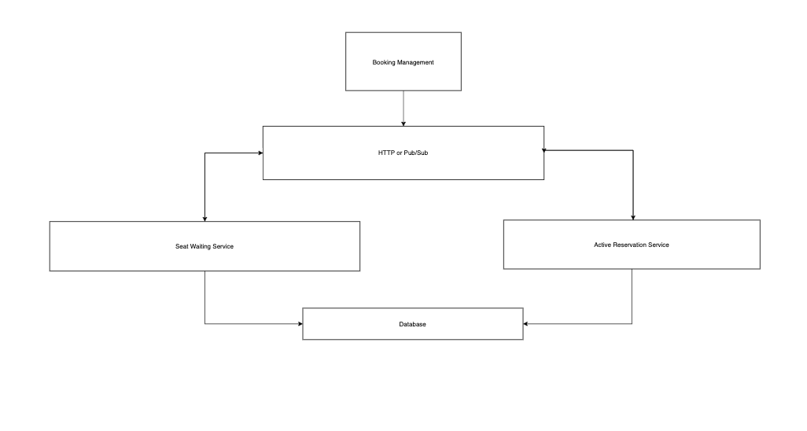

# Background

System Design questions tests the candidate ability to be able to create a system based on a user prompt. A user prompt is either a client telling you what they want or a team making an assumption of what a potential user might want in an idea. What makes this different from an OOP Design question is that this focuses less on the application components themselves and more of the flow of data and how we scale that data based on our understanding of the various trade offs as we modify our system.

## Learning Objective
Understand the flow of data and how to scale.

## Design Fandango II

User prompt: I want to be able to book movie theater seats online.

Today, we are going to focus on scaling Fandango.

Draw data flow diagrams from client to server to database that encompasses caching, load balancing, and microservices. The scenarios/case studies that we need to address are as follows:

1. Our server is being hit with multiple requests at once from many different clients and the server can barely handle it anymore.
2. We have a feature which shows the most popular new releases but the query is really slow.
3. Our application is a monolith. If we make changes to a specific part of our application, we need to redeploy the entire thing.

## Strategy

Before addressing scaling, we should encourage the candidate to draw the layers of a web application as they have already been taught in the context of Fandango.

You should try to guide them by using the case studies above as launch off points. This keeps the question from being way too open ended as well as keeping it true to the lecture material.

### Sample Diagram of Web Application Layers

The candidates should be encouraged to discuss why this is not scalable.
A node process can only do some much on its own. They should be able to discuss how a load balancer or cache would fit into Fandango here.

### Case Study 1: Our server is being hit with multiple requests at once from many different clients and the server can barely handle it anymore

This would be a nice use case of a load balancer

A loader balancer shares the love of traffic/requests across a cluster of servers. Load balancers keep track of the status of our resources by performing regular health checks on our servers. This is also known as horizontal scaling where we add more servers to help us scale. Think of it like adding more buildings to a neighborhood (horizontal) vs. Adding more floor to a building (vertical).

They should also discuss some possible issues that may pop up using this type of architecture.

What if we were storing our sessions in the node process? A possible solution is something called "sticky sessions" where we configure our Load Balancer to send user session to the same machine that the request is being sent to.

### Case Study 2: We have a feature which shows the most popular new releases but the query is really slow

The goal for this case study is to try to get them to think about caching. Caching comes in many different forms. They might say, they can cache the query itself in some sort of object on the server. This is a completely viable solution. However, the data might become stale.

Lead them to thinking about a cache. Specifically you want them to talk about a cache with the Least Frequently Used eviction policy. The idea here is that we can keep track of new releases and their ticket sales. The ones with the ticket least ticket sales get bumped off the cache in favor of the ones with higher ticket sales.

### Case Study 3: Our application is a monolith. If we make changes to a specific part of our application, we need to redeploy the entire thing

The solution to this would be microservices. Microservices are their own environments of codebases, deployment strategies, servers, etc. They are usually used to separate tightly coupled functionality or separate different business use cases into their own services (Ex: Uber Taxi and Uber Eats could be two different microservices). They should be able to identify what would be a feature on Fandango that would be appropriate to split into microservices.

The Booking Service would be a good candidate to split into microservices. In addition, they should be able to note how the services would work individually as well as how they would interact with each other. Expectation:

- Activity Diagram or Step By Step Process
- Data flow without the items in the previous case studies

An important discussion to have is how do these services communicate with each other? There are many ways in which we know such as our typical REST API but we can also use pub/sub design pattern. Since, the latter is out of scope, it can be ignored. The short answer is that the pub/sub pattern is a generalization of something we have used way back when: `addEventListener`

### Sample Active Reservation Service

- Keep the reservation on a cache for about 5 minutes
- Could update Booking table in DB with expiry time and status would be set to “On Hold”
- If 5 minutes passes, the hold is released
    - Notify current user
    - Send update to Seat Waiting Service
- If seats are purchased, update status in DB to “Booked”
    - Send update to Seat Waiting Service

### Sample Seat Waiting Service

- Queue of waiting users for seats
    - First come; first serve
    - Users can add themselves to queue of waiting list on a possible seat or the booking in general
- Relating back to Active Reservation Service:
    - If timer for Active Reservation Service runs out, the person first on queue will be notified
    - If seat (or entire booking) is booked, notify everyone on the queue

## Sample Activity Diagram

## Sample Data Flow Diagram

The reason that the microservices don't have their own databases is that they depend on the same data. 

## Resource
* [Sample Slides](https://docs.google.com/presentation/d/1d3bDYaF7bPvfAv1JWEu4Y_ykhv_yVgRhgXd1E_2mfts/edit#slide=id.ga9979b04fa_0_45)
